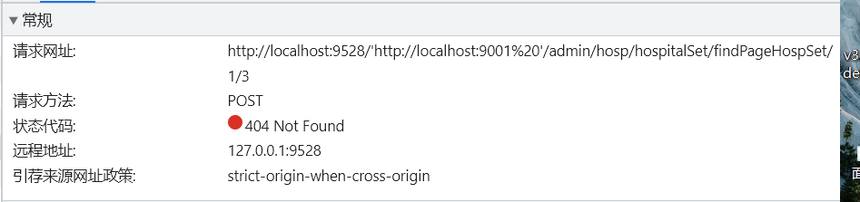
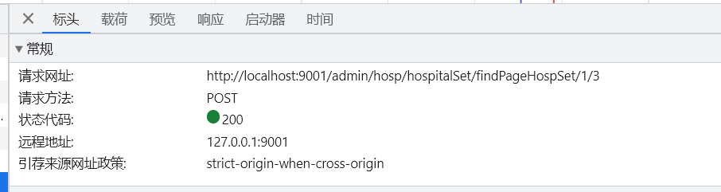

# vue-admin-template

> 这是一个极简的 vue admin 管理后台。它只包含了 Element UI & axios & iconfont & permission control & lint，这些搭建后台必要的东西。

[线上地址](http://panjiachen.github.io/vue-admin-template)

[国内访问](https://panjiachen.gitee.io/vue-admin-template)

目前版本为 `v4.0+` 基于 `vue-cli` 进行构建，若你想使用旧版本，可以切换分支到[tag/3.11.0](https://github.com/PanJiaChen/vue-admin-template/tree/tag/3.11.0)，它不依赖 `vue-cli`。

<p align="center">
  <b>SPONSORED BY</b>
</p>
<p align="center">
   <a href="https://finclip.com?from=vue_element" title="FinClip" target="_blank">
      
   </a>
</p>

## Extra

如果你想要根据用户角色来动态生成侧边栏和 router，你可以使用该分支[permission-control](https://github.com/PanJiaChen/vue-admin-template/tree/permission-control)

## 相关项目

- [vue-element-admin](https://github.com/PanJiaChen/vue-element-admin)

- [electron-vue-admin](https://github.com/PanJiaChen/electron-vue-admin)

- [vue-typescript-admin-template](https://github.com/Armour/vue-typescript-admin-template)

- [awesome-project](https://github.com/PanJiaChen/vue-element-admin/issues/2312)

写了一个系列的教程配套文章，如何从零构建后一个完整的后台项目:

- [手摸手，带你用 vue 撸后台 系列一(基础篇)](https://juejin.im/post/59097cd7a22b9d0065fb61d2)
- [手摸手，带你用 vue 撸后台 系列二(登录权限篇)](https://juejin.im/post/591aa14f570c35006961acac)
- [手摸手，带你用 vue 撸后台 系列三 (实战篇)](https://juejin.im/post/593121aa0ce4630057f70d35)
- [手摸手，带你用 vue 撸后台 系列四(vueAdmin 一个极简的后台基础模板,专门针对本项目的文章,算作是一篇文档)](https://juejin.im/post/595b4d776fb9a06bbe7dba56)
- [手摸手，带你封装一个 vue component](https://segmentfault.com/a/1190000009090836)

## Build Setup

```bash
# 克隆项目
git clone https://github.com/PanJiaChen/vue-admin-template.git

# 进入项目目录
cd vue-admin-template

# 安装依赖
npm install

# 建议不要直接使用 cnpm 安装以来，会有各种诡异的 bug。可以通过如下操作解决 npm 下载速度慢的问题
npm install --registry=https://registry.npm.taobao.org

# 启动服务
npm run dev
```

浏览器访问 [http://localhost:9528](http://localhost:9528)

## 发布

```bash
# 构建测试环境
npm run build:stage

# 构建生产环境
npm run build:prod
```

## 其它

```bash
# 预览发布环境效果
npm run preview

# 预览发布环境效果 + 静态资源分析
npm run preview -- --report

# 代码格式检查
npm run lint

# 代码格式检查并自动修复
npm run lint -- --fix
```


## 遇到的问题及解决方法 

1.添加nginx代理，使医院管理用8201端口，数据管理用82.2端口时，前端在[.env.development](.env.development)配置路由 ```http://localhost:9001  ``` 不用添加引号，非常神奇 

加引号



去掉引号


2.前端如何debug：
（1）按```F12```查看```控制台```的输出内容，根据报错排除
（2）按```F12```查看```网络```的请求内容、标头、预览、响应等内容，根据报错排除

3.出现跨域问题时，也可能是前后端的路由配置不一致导致的，比如前端配置的路由是```/api/xxx```，后端配置的路由是```/xxx```，这样也会出现跨域问题


学习参考文档

[vue-admin-template去除mock等开箱设置](https://juejin.cn/post/6844904145887952910)

[基于vue-admin-template开发后台管理项目,环境搭建流程](https://juejin.cn/post/7109672224822886407)


---------
更多信息请参考 [使用文档](https://panjiachen.github.io/vue-element-admin-site/zh/)

[MIT](https://github.com/PanJiaChen/vue-admin-template/blob/master/LICENSE) license.


